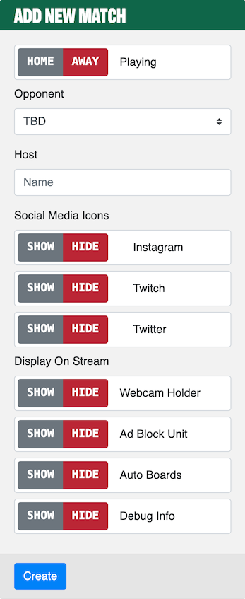
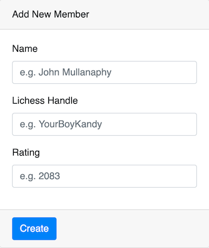
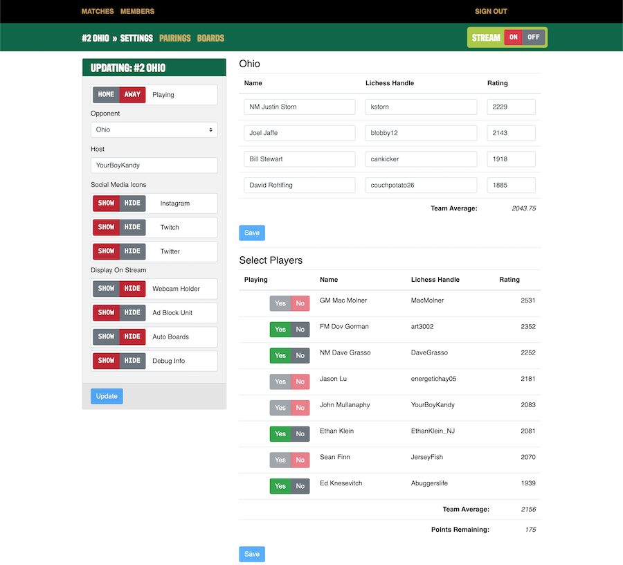
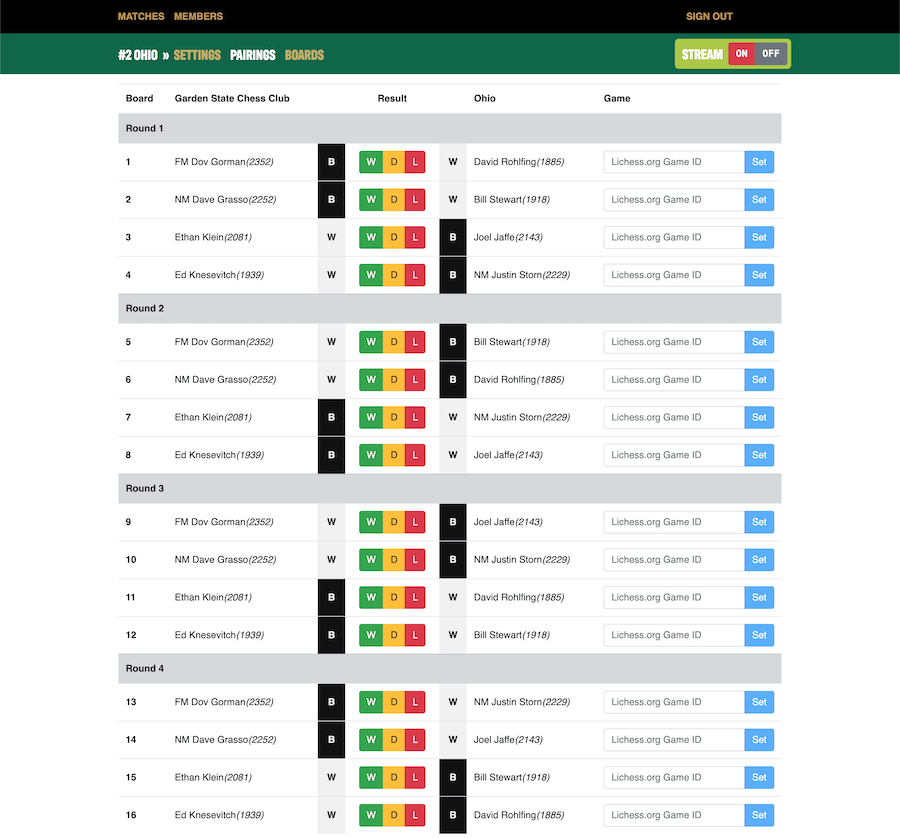
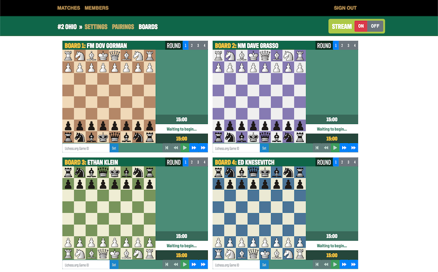

# Garden > Admin

This controls everything important. At the top level you can add Matches and Members. After creating Matches there is
then a section level to update Matches settings, opponent information, and then finally when there are full teams there
are [Matches](#pairings) and [Boards](#boards) available. 

---

## Administration

### Matches

#### List

By clicking on `MATCHES` in the top level you will get a list of all saved matches as well as a way to create a new
match. From the list of `Saved Matches` if you click on `Manage` you will change the second level links to reflect on
that match. E.g. in the image about if you were to click on `Manage` for `#1 New York` then [Settings](#settings),
[Matches](#pairings), and [Boards](#boards) would now be in relation to that match instead of `#2 Ohio`.

#### Create Matches

Creating a match is straightforward. Red on all toggle options means `Yes`, `On`, or `True` while the gray option is in
an off state. Going down the line here are the fields and what they do:

| Field              | Type    | Description                                                                                                                                                         |
|--------------------|---------|---------------------------------------------------------------------------------------------------------------------------------------------------------------------|
| Playing            | Option  | Set this to be what your team is for the given match. Changing the value will update colors for [Matches](#pairings).                                            |
| Opponent           | Select  | Choose the state you are playing. *NOTE(JM): Might update this to be a string field*.                                                                               |
| Host               | String  | Twitch handle or name of the match's host. This is the person that will be driving the stream and doing main commentary.                                            |
| Social Media Icons | Options | Turning on any of the three options: `Instagram`, `Twitch`, or `Twitter`; will display the icon next to the host's name. Useful when the host's name is a username. |
| Display On Stream  | Options | These will display different things on the stream. Check below in [Display On Stream Settings](#display-on-stream-settings) for more information.                   |

##### Display On Stream Settings

| Option        | Description                                                                                                                                                                                                                                                            |
|---------------|------------------------------------------------------------------------------------------------------------------------------------------------------------------------------------------------------------------------------------------------------------------------|
| Webcam Holder | This adds a nice holder to put a Webcam layer over. If the streamer uses a green screen or no camera this should be set to `HIDE`.                                                                                                                                     |
| Ad Block Unit | Depending on the number of images in [../stream/src/ad](../stream/src/ad) it will display `450x600` ads on the right hand side. Two or more images will fade between each other. Good to turn off if there are multiple webcams or such nots being added to the right. |
| Auto Boards   | **Experimental Feature!** These will add boards to the overlay that feed their data from the `Boards` tab on the second level menu. Admin actions on those boards will reflect in the overlay when `STREAM` is set to `ON`.                                            |
| Debug Info    | This will show boxes with dimensions on the overlay to help set things up in OBS. Make sure to have it set to `HIDE` when you're live!                                                                                                                                 |

#### Delete Matches

This one is straightforward. Just click on the `Delete` button next to a match in the list. You will get a confirmation
box and after confirming it will delete the match selected. Deleting matches sets a flag `deleted = true` in the SQL
database so no information is lost, it just won't serve the match or any auxiliary data to the project anymore.

### Members

Members are team members. There is no limit to how many members can exist for a team so feel free to add everybody that
might play for a given match. This list will populate the Settings page with the players that can be selected.

#### Create Member

All of these fields should hopefully be obvious. Just in case here's the breakdown.

| Field          | Type   | Description                                                                                                                    |
|----------------|--------|--------------------------------------------------------------------------------------------------------------------------------|
| Name           | String | Player's full name that they would like to go by, please include any titles they may possess here as well, e.g. GM Mac Molner. |
| Lichess Handle | String | Player's username at lichess.org                                                                                               |
| Rating         | Number | Player's USCF rating.                                                                                                          |

#### Delete Member

Same operation as [Delete Matches](#delete-match) where you will have to confirm the deletion after pressing `Delete` on a
specific member. This will also set a flag `deleted = true` in the corresponding SQL database instead of actually
deleting the row.

### Settings

This section is for configuring the specific match. The original settings from [Create Matches](#create-match) are
editable here if need be and everything has the same meaning as before.

#### Opponents

The top player list here is for the opponent team. Since matches are set to four boards this auto generates an empty
list when a new match is created. Enter in all of your opponent players here and the [Matches](#pairings) plus
[Boards](#boards) tabs will reflect any changes here.

#### Selected Players

Here is where you can select [Members](#members) to play. You can only select four players and the team average must be
below 2200. If both of those requirements are met you will then be able to save the players.

### Matches

This will be generated from [Opponents](#opponents) and [Selected Players](#selected-players) depending on if the team
is Home or Away. In the middle are the Result options, clicking on a Result will update the `Stream` accordingly with
the Result pressed and move a player's board to the next round until all results are in. It will also update the score
tally on stream. The `Lichess.org Game ID` is for the `Boards` tab with the experimental feature `Auto Boards` set to
`SHOW`. The game ids should be automatically picked up by the task that starts when a stream goes live yet just in case
there is an issue or it grabs the wrong game this can be updated here.

### Boards

**Experimental Feature**

When streaming this is the streamer's best toolset when going live. It allows the streamer to watch live games, move
forward/backward, and add drawings to the boards that are then reflected in real-time in the `Stream` overlay. As
matches are picked up during a live stream they will be added here round after round and a streamer can jump between
rounds if there was something they wished to show in a previous round. While all caught up, moves will react as Lichess
sends them, yet if they are jumping around then resuming will move forward at a second a move.

### Stream `ON` or `OFF`

This is a top switch, if it is set to on (red means on) then it will kick off a task to start looking for live games
based off of the [Opponents](#opponents) and [Selected Players](#selected-players) settings.

### Sign Out

Just signs you out of the admin panel.

---

## Authentication

Right now, this uses a very primitive Discord OAuth and checks for a specific server if the user has the Priority
Speaker option set to true.

*TODO(JM): Setup a Discord Bot to get actual user roles for a given server.*

---

## Commands

Commands are all the base `React.js` commands, just that `npm start` adds `PORT=4002` as a prefix. For more information
please refer to: <https://create-react-app.dev/docs/available-scripts/>

### Install `npm i`

Installs all `node_module` dependencies as well as runs `npm run build` to create the `./build` directory and final app.

### Build `npm run build`

Builds the `React.js` app into `./build`.

### Start `npm start`

Starts the development server for the project. This utilizes the `React.js` watch functionality so as files are edited
on the fly they will be reflected in the browser.

### Start Server `npm run start:server`

As opposed to the regular `npm start` this will actually start the frontward facing `Express` app instead of the
`React.js` development server. It will use the `React.js` app that was built to `./build` as well as serve the Discord
OAuth login screen.

### Test `npm t`

*TODO(JM): Need to learn more about unit testing in `React.js`*

### Eject `npm run eject`

This is non-reversible (mostly) and will eject all of the code outside of build environment.
