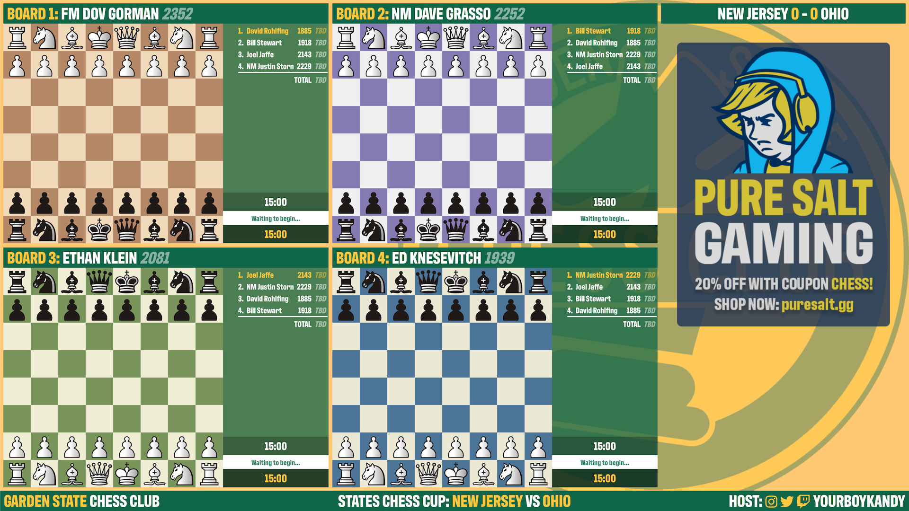

# Garden > Stream

This is the actual overlay that we include inside of OBS. All it does is consume data from [State](../state/README.md)
and present it in a nice fashion. All the assets in the repo as for Garden State Passers, so please make sure to
update that accordingly when developing an overlay for different teams. If I had planned on sharing the source code from
the get go I would have tried to be better in making it easier to skin.

---

## Endpoints

There are two main endpoints, each with an alias to a shorthand for the most recent match.

### Full Matches `/match/:matchId`, `/`

Going to just `/` will return the latest non deleted match. Both will return the main overlay which shows all four
boards along with any other settings. All display information is handled via [Admin](../admin/README.md).

### Board Highlight `/match/:matchId/board/:boardNumber`, `/board/:boardNumber`

Just like the case with [Full Matches](#full-match-matchmatchid-) the shorthand `/board/:boardNumber` will apply to the
most recent match. When a `:boardNumber` is supplied it will focus on one of the four boards in full size and hide the
other three (pending a new design).

---

## Commands

Commands are all the base `React.js` commands, just that `npm start` adds `PORT=4004` as a prefix. For more information
please refer to: <https://create-react-app.dev/docs/available-scripts/>

### Install `npm i`

Installs all `node_module` dependencies as well as runs `npm run build` to create the `./build` directory and final app.

### Build `npm run build`

Builds the `React.js` app into `./build`.

### Start `npm start`

Starts the development server for the project. This utilizes the `React.js` watch functionality so as files are edited
on the fly they will be reflected in the browser.

### Test `npm t`

*TODO(JM): Need to learn more about unit testing in `React.js`*

### Eject `npm run eject`

This is non-reversible (mostly) and will eject all of the code outside of build environment.
